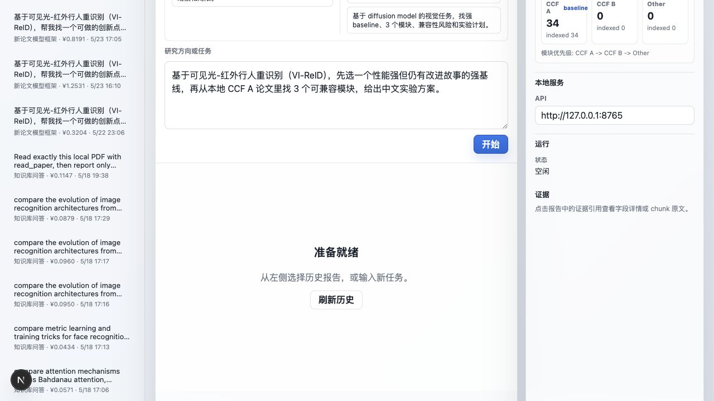
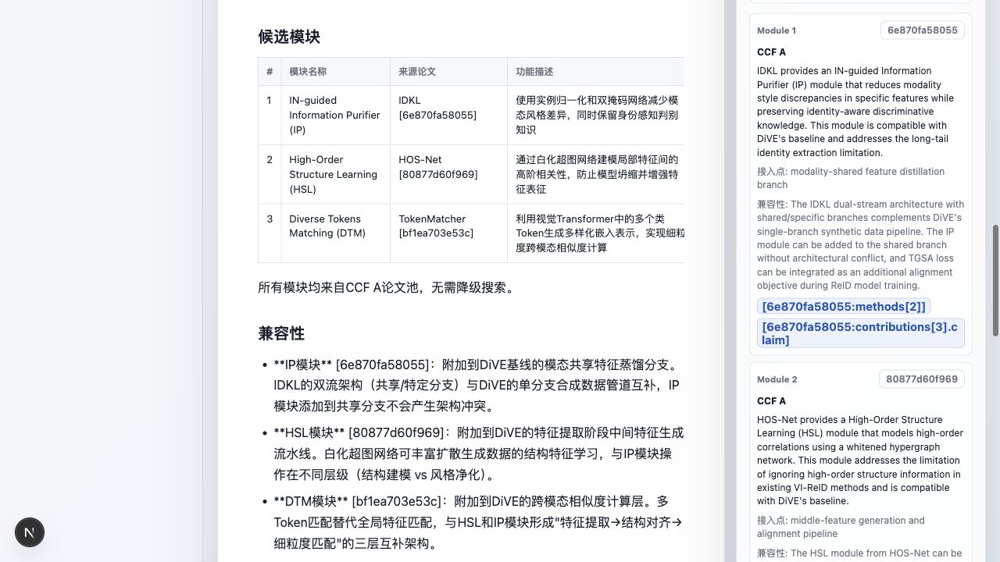
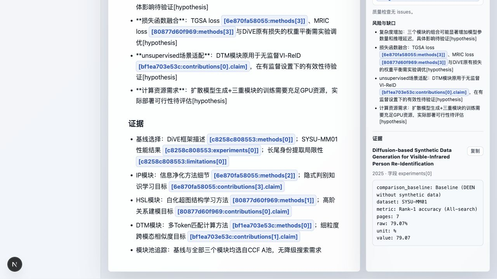
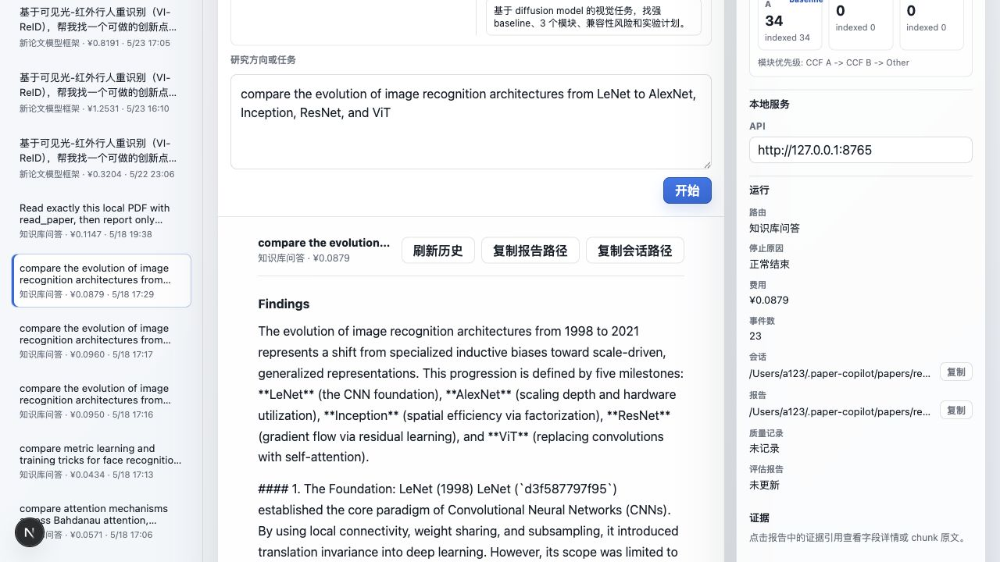

# Paper Copilot

> 本地优先的论文研究助手：阅读 PDF、检索个人论文库，并基于证据生成可验证的研究笔记与模型框架草案。


简体中文 | [English](README.en.md)

Paper Copilot 面向个人研究者的小规模本地论文库。它把 PDF 读成结构化报告，建立本地 SQLite / sqlite-vec 索引，通过一个自然语言输入框完成论文问答、跨论文检索、论文对比，以及“研究方向 -> baseline + 可接入模块 -> 可验证模型框架草案”的初步组合。

它的目标不是替你编造结果或自动写论文，而是把论文证据、来源、成本、trace 和失败边界都摆在台面上，让研究想法更容易被验证。

## 目录

- [前端演示](#前端演示)
- [项目状态](#项目状态)
- [核心能力](#核心能力)
- [快速开始](#快速开始)
- [安装](#安装)
- [配置](#配置)
- [运行](#运行)
- [本地 HTTP API](#本地-http-api)
- [数据目录](#数据目录)
- [开发](#开发)
- [路线图](#路线图)
- [已知限制](#已知限制)
- [贡献](#贡献)

## 前端演示

下面的截图组覆盖当前最重要的前端功能：自然语言研究入口、本地论文库状态、历史报告、Research Idea Composer、证据反查，以及知识库问答报告。

### 研究工作台与本地论文库



### Research Idea Composer



### 证据引用反查



### 知识库问答报告



## 项目状态

当前状态同步自 `TASKS.md`，更新时间为 2026-05-23。

Paper Copilot 已经推进到 chat-first 本地研究助手：

- 本地 API 可通过 `paper-copilot serve` 启动，核心入口是 `POST /chat`。
- `apps/web/` 已有 Next.js macOS 风格 chat shell，可展示资料库、历史报告、route/status、成本、Composer 摘要和 evidence。
- 检索侧已切到百炼 `text-embedding-v4`，并落地 FTS5/BM25 + vector RRF + multi-chunk evidence；已算过的文本 embedding 会复用本地缓存，避免重复调用模型。
- 当前本机默认测试库为 34 篇论文 / 2066 个 chunks。
- M19 Research Idea Composer 已接入 local-library-first 工具约束、deterministic plan/state、proposal checker、field/chunk evidence 反查和报告表格渲染。
- 当前验证边界：VI-ReID 单例 demo 已 clean 通过质量门；2-3 个固定任务的跨任务验收暂跳过，因此不声明跨任务稳定泛化。

当前 retrieval gate：

| 指标 | 当前结果 | 说明 |
| --- | ---: | --- |
| paper `recall@5` | 98.4% | 36 条 seed queries 的均值 |
| paper `recall@10` | 100.0% | paper 级召回已够用 |
| paper `precision@5` | 32.8% | topK 中 relevant papers 占比 |
| paper `precision@10` | 16.9% | topK 扩大后自然下降 |
| evidence `recall@5` | 87.2% | 13 条带 anchor queries 的均值；exact + semantic window match |
| evidence `recall@10` | 89.7% | paper 级命中后，证据 chunk 覆盖仍是已知风险 |
| evidence anchor `precision@5` | 44.9% | 只衡量 anchor/semantic-window 命中，不代表完整相关性 |
| evidence anchor `precision@10` | 45.3% | 同上，未标注 chunk 不计入完整相关性判断 |

这仍是实验性、本地优先、个人知识库规模的工具。目标规模是约 50-100 篇论文，不是托管 SaaS、多用户平台或开放式全自动文献综述系统。

## 核心能力

### 论文阅读

- 读取单篇 PDF，生成结构化 Markdown 报告。
- 提取贡献、方法、实验、局限和跨论文关系。
- 每篇论文保留 `session.jsonl`，可追溯每次 LLM 调用、schema 输出和成本。

### 本地论文库检索

- 用 `fields.db` 管理结构化字段。
- 用 `embeddings.db` 和 `sqlite-vec` 做跨论文向量检索。
- 用 FTS5/BM25 + dense retrieval + RRF 融合返回相关论文和 evidence chunks。
- 不依赖外部向量数据库，适合个人本地库。

### Chat-first 研究入口

- 用户输入一句自然语言请求。
- runtime 自动路由到 `knowledge_qa` 或 `framework_composer`。
- 输出 Markdown 报告、route、session/report 路径、成本、终止原因和 paper budget。

### 新论文模型框架草案

给定一个研究方向，Paper Copilot 可以从本地论文库中：

1. 找一个 strong baseline。
2. 按 CCF A -> CCF B -> Other 的本地资料池优先级检索候选模块。
3. 用 deterministic Composer plan/state 约束 baseline 选择、模块选择和 fallback 顺序。
4. 分析模块兼容性、接入点和风险。
5. 生成 baseline + modules 的模型框架草案、消融实验计划和证据引用。
6. 用 proposal checker 拦截无引用指标提升、训练超参、复杂度变化等 unsupported claims，并把不确定内容降级为待验证假设。

这里的输出是“可验证研究草案”，不是论文成稿，也不会声称已经证明了效果。

### Eval 与可观测性

- 字段级 golden regression。
- retrieval query suite。
- run history + 静态 HTML 趋势报告。
- cache 命中率、latency、token 和人民币成本统计。

## 快速开始

### 1. 安装本地后端

```bash
git clone https://github.com/lemma42796/paper-copilot.git
cd paper-copilot
uv tool install .
```

本地开发建议使用：

```bash
uv sync --dev
```

### 2. 配置模型和论文目录

```bash
cp .env.example .env
```

编辑 `.env`：

```bash
ANTHROPIC_BASE_URL=https://dashscope.aliyuncs.com/apps/anthropic
ANTHROPIC_API_KEY=sk-your-key-here
DASHSCOPE_API_KEY=sk-your-key-here
PAPER_COPILOT_PDF_DIR=/path/to/your/papers
```

### 3. 启动本地 API 和 Web UI

终端 1：

```bash
paper-copilot serve --host 127.0.0.1 --port 8765
```

终端 2：

```bash
cd apps/web
npm ci
npm run dev
```

打开 `http://127.0.0.1:3000`。

## 安装

环境要求：

- Python 3.12+
- [`uv`](https://docs.astral.sh/uv/)
- Node.js 20+，仅 Web UI 需要
- DashScope / 百炼 API key

安装方式：

```bash
git clone https://github.com/lemma42796/paper-copilot.git
cd paper-copilot
uv tool install .
```

重新安装当前代码：

```bash
uv tool install . --reinstall
```

开发模式：

```bash
uv sync --dev
```

## 配置

`.env.example` 默认使用阿里云百炼 DashScope 的 Anthropic-compatible LLM endpoint，以及 DashScope OpenAI-compatible embedding endpoint。

| 变量 | 用途 |
| --- | --- |
| `ANTHROPIC_BASE_URL` | LLM endpoint，默认指向百炼 Anthropic-compatible API |
| `ANTHROPIC_API_KEY` | LLM API key |
| `DASHSCOPE_API_KEY` | `text-embedding-v4` embedding API key |
| `PAPER_COPILOT_HOME` | 运行时数据根目录，默认 `~/.paper-copilot` |
| `PAPER_COPILOT_PDF_DIR` | chat/research 默认本地论文目录 |

新环境需要先准备本地论文目录。已有历史 session 时，可以用 PDF 目录重建索引：

```bash
paper-copilot reindex --pdf-dir /path/to/your/papers
```

## 运行

Web UI 是当前产品主入口：

```bash
paper-copilot serve --host 127.0.0.1 --port 8765
cd apps/web
npm ci
npm run dev
```

可以输入类似：

```text
针对行人重识别，先选一个 strong baseline，再从近年论文找可插拔模块，组合成可验证的新模型框架，并给出消融实验计划和证据引用。
```

## 本地 HTTP API

本地 API 故意保持轻量，当前基于 Python stdlib HTTP server，不引入 FastAPI。

| Method | Path | 说明 |
| --- | --- | --- |
| `GET` | `/health` | 健康检查 |
| `POST` | `/chat` | 运行自然语言请求 |
| `GET` | `/reports` | 列出最近 chat/research 报告 |
| `GET` | `/evidence?ref=...` | 把 evidence ref 解析为 chunk 原文 |
| `POST` | `/library/select-directory` | Web UI 使用的桌面目录选择器 |

`POST /chat` 示例：

```bash
curl -sS -X POST http://127.0.0.1:8765/chat \
  -H 'Content-Type: application/json' \
  -d '{
    "message": "找一个 ReID strong baseline，再找 2-3 个可接入模块，给出实验计划",
    "pdf_dir": "/path/to/your/papers",
    "max_turns": 16,
    "budget_cny": 2.0,
    "max_papers": 5
  }'
```

响应包含：

- route / task profile
- Markdown report
- session path / report path
- quality run path / eval report path
- termination reason
- cost
- events count
- paper budget

## 架构

```text
apps/web
  -> local HTTP API
  -> chat.runtime.handle_chat_request()
  -> ResearchAgent bounded tool loop
  -> local knowledge stores
  -> Markdown reports + JSONL traces + eval rows
```

主要模块：

| 路径 | 职责 |
| --- | --- |
| `src/paper_copilot/api/` | 本地 HTTP API |
| `src/paper_copilot/chat/` | 单输入框路由与 runtime |
| `src/paper_copilot/agents/` | 阅读 agents 与 research loop |
| `src/paper_copilot/knowledge/` | 跨论文索引与 hybrid search |
| `src/paper_copilot/retrieval/` | 单论文 chunk / section 工具 |
| `src/paper_copilot/eval/` | 回归、retrieval eval 与报告 |
| `src/paper_copilot/session/` | JSONL session 存储 |
| `apps/web/` | Next.js 本地前端 |

更多设计细节见 [ARCHITECTURE.md](ARCHITECTURE.md) 和 [chat-first roadmap](docs/design/chat_first_research_copilot_plan.md)。

## 数据目录

运行时数据默认在仓库外：

```text
~/.paper-copilot/
├── papers/<paper_id>/
│   ├── source.pdf
│   ├── session.jsonl
│   ├── report.md
│   └── research-report.md
├── fields.db
├── embeddings.db
├── embeddings_meta.json
├── embedding_cache.sqlite
├── graph/cross-paper-links.jsonl
└── eval/
    ├── runs/<run_id>.jsonl
    └── report.html
```

`paper_id = SHA1(PDF bytes)[:12]`，所以 PDF 改名或移动位置不会改变 ID。
`embeddings.db` 保存论文库 chunks 的检索向量；`embedding_cache.sqlite` 保存 query、evidence anchor、semantic window 等文本的复用缓存，key 包含模型名和维度。

仓库内 eval 资产：

```text
eval/
├── goldens/<paper_id>_<field>.json
├── retrieval/queries.yaml
└── suites/smoke.yaml
```

## 开发

```bash
uv sync --dev
make lint
make typecheck
make test
```

文档改动可先跑：

```bash
git diff --check -- README.md README.en.md
```

改默认模型 tier 前，需要跑 smoke eval，并同时比较质量、成本和延迟。历史 plus-tier 试验显示：plus 通过回归，但成本约 2.03x、延迟约 2.22x，且没有测到质量收益，所以默认仍保持 flash tier。

## 路线图

近期进展和下一步以 [TASKS.md](TASKS.md) 为准。

当前优先级：

1. 冻结现有功能面，优先做 README、demo 截图和简历叙事收口。
2. 保持 local-library-first Composer 的 ReID demo 可展示，并清楚标注跨任务泛化边界。
3. 如后续继续工程化，再补固定 Composer 任务验收、retrieval misses/top-k 诊断前端化和 unsupported claim 人工抽样。

## 已知限制

- 不支持云同步、账号、多用户 ACL 或托管部署。
- 核心运行时不联网发现论文，只基于本地 PDF 和本地索引。
- active retrieval path 没有 cross-encoder 或 LLM reranker。
- evidence chunk grounding 仍是已知风险，不能把每条生成 claim 都视为完全 grounded。
- Research Idea Composer 当前只有 VI-ReID 单例 demo clean 通过，尚未做多任务稳定性验收。
- 部分 eval suite 依赖本地 PDF，仓库不会随附论文原文。

## 贡献

这是一个实验性的 local-first 研究工具。提交 PR 前请先阅读 [AGENTS.md](AGENTS.md)。

基本原则：

- 保持改动范围小。
- 说明用户可见行为。
- 不要在未讨论 tradeoff 的情况下新增依赖。
- 优先做可追溯、可评估的 harness 改进，而不是只改 prompt。

## License

MIT。详见 [LICENSE](LICENSE)。
