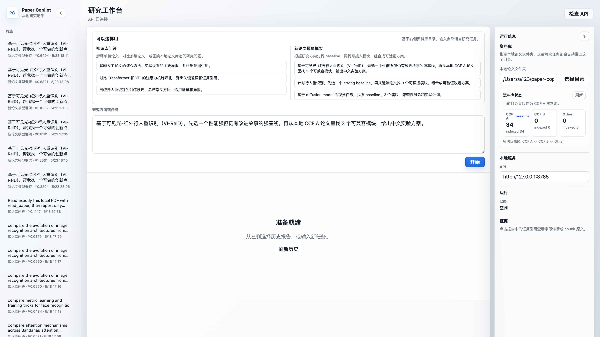
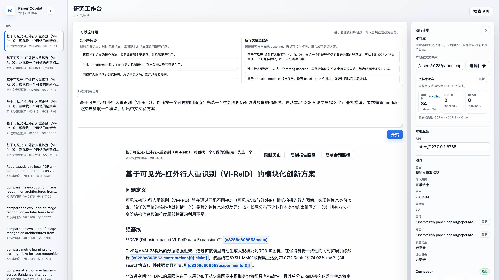
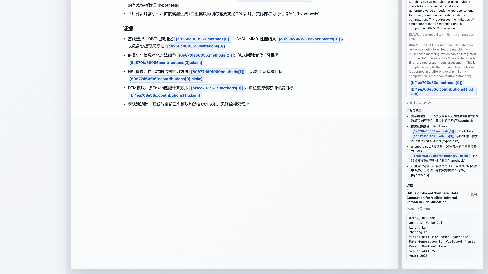
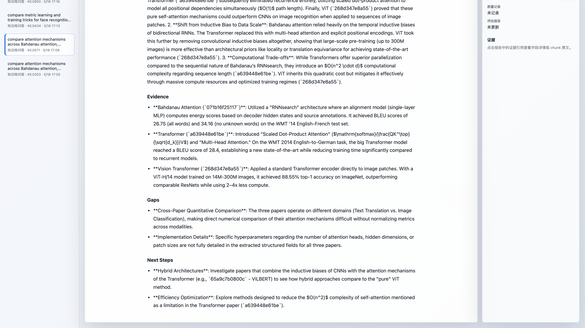

# Paper Copilot

> 本地优先的论文研究助手：阅读 PDF、检索个人论文库，并基于证据生成可验证的研究笔记与模型框架草案。


简体中文 | [English](README.en.md)

Paper Copilot 面向个人研究者的小规模本地论文库。它把 PDF 读成结构化报告，建立本地 SQLite / sqlite-vec 索引，通过一个自然语言输入框完成论文问答、跨论文检索、论文对比，以及“研究方向 -> baseline + 可接入模块 -> 可验证模型框架草案”的初步组合。

它的目标不是替你编造结果或自动写论文，而是把论文证据、来源、成本、trace 和失败边界都摆在台面上，让研究想法更容易被验证。

PDF、索引、session、报告和 trace 默认保存在用户设备。本地检索选出的必要文本片段可能发送给用户配置的云端模型；“PDF 不上传”不等于“任何论文内容都不会离开设备”。

## 目录

- [前端演示](#前端演示)
- [项目状态](#项目状态)
- [核心能力](#核心能力)
- [快速开始](#快速开始)
- [安装](#安装)
- [配置](#配置)
- [运行](#运行)
- [本地 HTTP API](#本地-http-api)
- [数据目录](#数据目录)
- [开发](#开发)
- [路线图](#路线图)
- [已知限制](#已知限制)
- [贡献](#贡献)

## 前端演示

下面的截图组记录迁移期 Next.js Web UI 已实现的功能：自然语言研究入口、本地论文库状态、历史报告、Research Idea Composer、证据反查，以及知识库问答报告。当前里程碑正在用 SwiftUI 构建原生 macOS 客户端；Web UI 在原生客户端达到功能对等前继续保留。

### 研究工作台与本地论文库



### Research Idea Composer



### 证据引用反查



### 知识库问答报告



## 项目状态

当前状态同步自 `TASKS.md`，更新时间为 2026-07-24。

Paper Copilot 正在重构为两个复用同一 Python Core 的本地产品入口：

- SwiftUI macOS 客户端：M20 已完成，负责原生窗口、目录授权、Keychain、任务与报告界面，以及 Python Runtime 生命周期。
- Local MCP Server：M21/M22 已完成，提供本地 `stdio` transport、六个只读论文工具
  和四个长任务工具，并已通过真实 Codex Agent 工具发现与查询验收。
- M23 已完成内嵌 Python Runtime 的 arm64 `.app` 和开发预览 DMG，并通过真实安装与
  论文任务验收；终端用户运行它不需要安装 Python、uv 或 Node.js。预览包使用 ad-hoc
  签名，Developer ID 和 Apple 公证留到正式发布阶段。

现有 Python 与 Web 基线：

- 终端命令行界面已移除；本地 HTTP API 由宿主进程调用
  `paper_copilot.api.http.serve_http_api()` 提供，Web 前端使用持久 job 接口，
  任务进度优先通过 WebSocket 推送，自动回退到 SSE 和增量轮询；`POST /chat`
  保留为同步兼容入口。
- `apps/web/` 是迁移期 Next.js chat shell，可展示资料库、多轮会话、任务进度、
  成本、Composer 摘要和 evidence；SwiftUI 功能对等并人工确认前不会删除。
- 检索侧已切到百炼 `text-embedding-v4`，并落地 FTS5/BM25 + vector RRF + multi-chunk evidence；已算过的文本 embedding 会复用本地缓存，避免重复调用模型。
- 持久 job 支持 attempt、中断、rollout replay、conversation history、上下文压缩和
  本地 rollout diagnostics。
- Research Idea Composer 已接入 deterministic plan/state、proposal checker、
  field/chunk evidence 反查和 Markdown 报告渲染。

这仍是实验性、本地优先、个人知识库规模的工具。目标规模是约 50-100 篇论文，不是托管 SaaS、多用户平台或开放式全自动文献综述系统。

## 核心能力

### 论文阅读

- 读取单篇 PDF，生成结构化 Markdown 报告。
- 提取贡献、方法、实验、局限和跨论文关系。
- 每篇论文保留 `session.jsonl`，可追溯每次 LLM 调用、schema 输出和成本。

### 本地论文库检索

- 用 `fields.db` 管理结构化字段。
- 用 `embeddings.db` 和 `sqlite-vec` 做跨论文向量检索。
- 用 FTS5/BM25 + dense retrieval + RRF 融合返回相关论文和 evidence chunks。
- 不依赖外部向量数据库，适合个人本地库。

### Chat-first 研究入口

- 用户输入一句自然语言请求。
- Paper Copilot 直接判断是回答用户，还是调用一个或多个工具。
- 普通聊天不调用论文工具；需要本地证据、PDF 阅读或方案生成时由模型选择工具。
- 输出 Markdown 回答、session/report 路径、成本、终止原因和 paper budget。

### 新论文模型框架草案

给定一个研究方向，Paper Copilot 可以从本地论文库中：

1. 找一个 strong baseline。
2. 按 CCF A -> CCF B -> Other 的本地资料池优先级检索候选模块。
3. 用 deterministic Composer plan/state 约束 baseline 选择、模块选择和 fallback 顺序。
4. 分析模块兼容性、接入点和风险。
5. 生成 baseline + modules 的模型框架草案、消融实验计划和证据引用。
6. 用 proposal checker 拦截无引用指标提升、训练超参、复杂度变化等 unsupported claims，并把不确定内容降级为待验证假设。

这里的输出是“可验证研究草案”，不是论文成稿，也不会声称已经证明了效果。

### Eval 与可观测性

- 字段级 golden regression。
- retrieval query suite。
- run history + 静态 HTML 趋势报告。
- cache 命中率、latency、token 和人民币成本统计。

## 快速开始

### 1. 准备本地后端开发环境

```bash
git clone https://github.com/lemma42796/paper-copilot.git
cd paper-copilot
uv sync --dev
```

### 2. 配置模型和论文目录

```bash
cp .env.example .env
```

编辑 `.env`：

```bash
LLM_BASE_URL=https://dashscope.aliyuncs.com/compatible-mode/v1
LLM_API_KEY=sk-your-key-here
LLM_MODEL=qwen3.6-flash
DASHSCOPE_API_KEY=sk-your-key-here
PAPER_COPILOT_PDF_DIR=/path/to/your/papers
```

### 3. 启动现有本地 API 和迁移期 Web UI

仓库不再提供终端命令行入口。桌面宿主或其他 Python 进程可直接调用：

```python
from paper_copilot.api.http import serve_http_api

serve_http_api(host="127.0.0.1", port=8765)
```

HTTP API 默认监听 `8765`，任务 WebSocket 默认监听相邻的 `8766`。如需调整，
传入 `websocket_port`；前端从 `/health` 响应发现地址，无需单独配置。

迁移期 Web 前端开发：

```bash
cd apps/web
npm ci
npm run dev
```

打开 `http://127.0.0.1:3000`。

## 安装

环境要求：

- Python 3.12+
- [`uv`](https://docs.astral.sh/uv/)
- Node.js 20+，仅 Web UI 需要
- DashScope / 百炼 API key

开发环境：

```bash
git clone https://github.com/lemma42796/paper-copilot.git
cd paper-copilot
uv sync --dev
```

开发用 Apple Silicon DMG：

```bash
./scripts/build_macos_dmg.sh
open dist/macos/PaperCopilot-arm64.dmg
```

构建脚本输出包含 Python Runtime 的 `dist/macos/PaperCopilot-arm64.dmg`，并使用本地
ad-hoc 签名。首次打开 GitHub 下载的预览版时，macOS 会阻止未知开发者 App；确认下载
来源可信后，先尝试打开一次，再前往“系统设置 -> 隐私与安全性”点击“仍要打开”。
不要关闭整个 Gatekeeper。

加入 Apple Developer Program 后，可在本机 Keychain 安装 Developer ID Application
证书，并通过环境变量启用正式签名：

```bash
PAPER_COPILOT_SIGN_IDENTITY="Developer ID Application: Example (TEAMID)" \
PAPER_COPILOT_NOTARY_PROFILE="paper-copilot-notary" \
./scripts/build_macos_dmg.sh
```

`PAPER_COPILOT_NOTARY_PROFILE` 是预先通过 `xcrun notarytool store-credentials` 保存到
Keychain 的配置名；证书和 Apple 凭据不会写入仓库。未设置这两个变量时，脚本只生成
未公证的开发预览包。

## 配置

`.env.example` 默认使用阿里云百炼 DashScope 的 OpenAI-compatible Chat
Completions endpoint，以及 DashScope embedding endpoint。LLM 客户端也可连接
DeepSeek 官方 OpenAI-compatible endpoint。

| 变量 | 用途 |
| --- | --- |
| `LLM_BASE_URL` | OpenAI-compatible LLM base URL，默认指向百炼 compatible-mode API |
| `LLM_API_KEY` | LLM API key |
| `LLM_MODEL` | 模型 ID，默认 `qwen3.6-flash` |
| `DASHSCOPE_API_KEY` | `text-embedding-v4` embedding API key |
| `PAPER_COPILOT_HOME` | 运行时数据根目录，默认 `~/.paper-copilot` |
| `PAPER_COPILOT_PDF_DIR` | chat/research 默认本地论文目录 |

新环境需要先准备本地论文目录。索引会在产品读取论文时同步更新；embedding
模型或维度变化后，宿主应用必须在继续查询前触发索引重建。

使用 DeepSeek 官方 API 时，把三个 LLM 变量改为：

```bash
LLM_BASE_URL=https://api.deepseek.com
LLM_API_KEY=sk-your-deepseek-key
LLM_MODEL=deepseek-v4-flash
```

embedding 仍使用独立的 `DASHSCOPE_API_KEY`。

## 运行

迁移期 Web UI 仍可用于开发和回归现有能力。它依赖宿主进程提供本地 HTTP API；
仓库不再暴露面向用户的交互式终端界面：

```bash
cd apps/web
npm ci
npm run dev
```

可以输入类似：

```text
针对行人重识别，先选一个 strong baseline，再从近年论文找可插拔模块，组合成可验证的新模型框架，并给出消融实验计划和证据引用。
```

### Local MCP Server

开发环境可把本地 `stdio` Server 加入 Codex：

```bash
codex mcp add paper-copilot -- \
  uv --directory /absolute/path/to/paper-copilot run paper-copilot-mcp
```

Server 提供只读的 `library_status`、`list_papers`、`search_papers`、`get_paper`、
`inspect_evidence`、`compare_papers`，以及长任务工具 `start_read_paper`、
`get_job_status`、`get_job_result`、`cancel_job`。搜索在环境中有
`DASHSCOPE_API_KEY` 或 `LLM_API_KEY` 时使用现有 hybrid retrieval，否则使用本地
FTS5/BM25。

在 Codex 桌面端的 MCP Server 设置中，可在“环境变量”加入
`DASHSCOPE_API_KEY=sk-...`，保存后重启 Server。也可以在项目根目录的 `.env`
配置同名变量。成功启用 query embedding 后，`search_papers` 返回
`retrieval_mode=hybrid` 和 `query_sent_to_embedding_provider=true`。

普通只读 MCP 工具不会进入 Paper Copilot Agent loop，也不会调用默认模型。Codex 等
MCP Host 负责理解请求和编排工具；Server 只做 MCP schema 校验、服务层业务校验和
只读 Core 调用。只有 hybrid 搜索的 query embedding 会使用 `text-embedding-v4`。

`start_read_paper` 是显式的长任务入口：它只接受配置目录内本地 PDF 的 `paper_id`，
立即返回 job id，并通过现有 job/attempt/recovery runtime 启动 Paper Copilot Agent。
它会花费返回值中标明的 LLM budget，并写入本地 job、session、report 和索引状态，但
不会修改 PDF 论文库。使用 `get_job_status` 返回的事件游标增量轮询，完成后调用
`get_job_result`；`cancel_job` 只提交取消请求，实际状态以之后的 status 查询为准。

工具不会上传完整 PDF 或 session，也不返回本机结果路径，但 MCP 客户端通常会把返回
的论文摘要、evidence 和任务报告交给其模型处理。使用云端 MCP 客户端前，应把这些
返回内容视为会离开设备的数据。

## 本地 HTTP API

本地 API 故意保持轻量，当前基于 Python stdlib HTTP server 和 `websockets`，
不引入 FastAPI。

| Method | Path | 说明 |
| --- | --- | --- |
| `GET` | `/health` | 健康检查和 WebSocket 地址发现 |
| `POST` | `/jobs` | 创建持久后台任务 |
| `GET` | `/jobs` | 列出最近任务 |
| `GET` | `/jobs/<id>` | 查询任务状态和结果 |
| `GET` | `/jobs/<id>/events?after=N` | 增量读取任务进度 |
| `GET` | `/jobs/<id>/stream?after=N` | SSE 任务进度流（WebSocket 故障回退） |
| `POST` | `/jobs/<id>/interrupt` | 请求停止正在运行的 attempt |
| `POST` | `/jobs/<id>/resume` | 为中断或失败任务创建新 attempt |
| `POST` | `/chat` | 同步运行自然语言请求（兼容入口） |
| `GET` | `/reports` | 列出最近 chat/research 报告 |
| `GET` | `/evidence?ref=...` | 把 evidence ref 解析为 chunk 原文 |
| `POST` | `/library/select-directory` | Web UI 使用的桌面目录选择器 |

WebSocket 使用 `ws://127.0.0.1:8766/jobs/<id>/stream?after=N`。它同时承载
`job/events` 服务端通知，以及带请求 id 的 `job/interrupt`、`job/resume` 双向控制。
连接尚未建立时，控制操作回退到对应 HTTP API；事件流连接失败时切换到同路径的
SSE，SSE 也不可用时才轮询 `events` 和 job 状态接口。三个事件通道使用同一个事件
序号游标，因此切换不会重复展示进度。

WebSocket 控制请求示例：

```json
{"id":1,"method":"job/interrupt","params":{}}
```

对应响应包含同一个 `id` 和更新后的 job record；业务错误通过 `error` 返回。事件通知
不带请求 id，格式为 `{"method":"job/events","params":{...}}`。

`POST /jobs` 示例：

```bash
curl -sS -X POST http://127.0.0.1:8765/jobs \
  -H 'Content-Type: application/json' \
  -d '{
    "message": "找一个 ReID strong baseline，再找 2-3 个可接入模块，给出实验计划",
    "pdf_dir": "/path/to/your/papers",
    "max_turns": 16,
    "budget_cny": 2.0,
    "max_papers": 5
  }'
```

创建接口立即返回持久 job；随后通过 job 查询和 events 接口读取状态、进度及最终
结果。任务运行时，输入框发送按钮切换为停止按钮；停止请求会取消当前 Agent task，
在 session 中记录 `turn_aborted` 并把 job 标为 interrupted。中断或失败后不会自动重跑，
只有用户在原会话输入“继续刚才中断的任务”时，
前端才请求新的 attempt。新 attempt 从上一 attempt 的持久化 rollout 重建模型历史，
复用已经完成的工具结果，将没有结果的工具调用标记为 `aborted`，并恢复论文预算、
累计模型成本和 Composer 状态。它不是从某个 LLM token、网络流或外部进程原地续跑。

客户端断开、上游断网、服务重启、用户显式停止和 rollout replay 已用无外网确定性模型专项验收。
验收确认已完成工具结果不会再次 dispatch，缺失结果会补为 `aborted`，连续恢复可正确
衔接 attempt 1→2→3，JSONL 损坏尾行不会破坏后续追加。

继续追问时，在新 job 请求中传回上一轮响应里的 `spec.conversation_id`：

```json
{
  "message": "为什么上一轮更推荐这个 baseline？",
  "conversation_id": "conversation-20260722T120000-1234567890"
}
```

后端会把该 conversation 已完成的前序问答作为受控上下文交给新一轮 Agent。每轮仍有
独立 session 和费用；failed/interrupted 输出不会进入后续会话上下文。

完成后的 job 结果包含：

- Markdown report
- session path / report path
- quality run path / eval report path
- termination reason
- cost
- events count
- paper budget

## 架构

```text
SwiftUI macOS Client ─┐
Legacy Next.js Web UI ├─> local HTTP/job API ─> Python Paper Core
Local MCP Server ────────> read-only MCP tools ─┘

Python Paper Core
  -> chat.jobs persistent lifecycle
  -> chat.runtime.handle_chat_request()
  -> Paper Copilot bounded tool loop
  -> local knowledge stores
  -> Markdown reports + JSONL traces + eval rows
```

主要模块：

| 路径 | 职责 |
| --- | --- |
| `src/paper_copilot/api/` | 本地 HTTP API |
| `src/paper_copilot/chat/` | 单输入框 runtime 与历史记录 |
| `src/paper_copilot/mcp/` | 本地只读 `stdio` MCP Server |
| `src/paper_copilot/agents/` | 单一 Paper Copilot、tool loop 与读论文工具 |
| `src/paper_copilot/knowledge/` | 跨论文索引与 hybrid search |
| `src/paper_copilot/retrieval/` | 单论文 chunk / section 工具 |
| `src/paper_copilot/eval/` | 回归、retrieval eval 与报告 |
| `src/paper_copilot/session/` | JSONL session 存储 |
| `apps/macos/` | M20 SwiftUI 原生客户端 |
| `apps/web/` | 迁移期 Next.js 前端 |

更多设计细节见 [ARCHITECTURE.md](ARCHITECTURE.md)，当前里程碑见 [TASKS.md](TASKS.md)。

## 数据目录

运行时数据默认在仓库外：

```text
~/.paper-copilot/
├── papers/<paper_id>/
│   ├── source.pdf
│   ├── session.jsonl
│   ├── report.md
│   └── research-report.md
├── fields.db
├── embeddings.db
├── embeddings_meta.json
├── embedding_cache.sqlite
├── graph/cross-paper-links.jsonl
├── jobs/<job_id>/
│   ├── job.json
│   ├── events.jsonl
│   └── attempts/<n>/
│       ├── manifest.json
│       ├── trace.jsonl
│       ├── state.json
│       └── payloads/
└── eval/
    ├── runs/<run_id>.jsonl
    └── report.html
```

`paper_id = SHA1(PDF bytes)[:12]`，所以 PDF 改名或移动位置不会改变 ID。
`embeddings.db` 保存论文库 chunks 的检索向量；`embedding_cache.sqlite` 保存 query、evidence anchor、semantic window 等文本的复用缓存，key 包含模型名和维度。

仓库内 eval 资产：

```text
eval/
├── goldens/<paper_id>_<field>.json
├── retrieval/queries.yaml
└── suites/smoke.yaml
```

## 开发

```bash
uv sync --dev
make lint
make typecheck
make test
```

文档改动可先跑：

```bash
git diff --check -- README.md README.en.md
```

改默认模型 tier 前，需要跑 smoke eval，并同时比较质量、成本和延迟。历史 plus-tier 试验显示：plus 通过回归，但成本约 2.03x、延迟约 2.22x，且没有测到质量收益，所以默认仍保持 flash tier。

## 路线图

近期进展和下一步以 [TASKS.md](TASKS.md) 为准。

当前优先级：

1. M20 SwiftUI macOS Client Foundation 已完成。
2. M21 Local Read-only MCP 已完成。
3. M22 MCP Long-running Jobs 已完成。
4. M23 已完成开发用 arm64 `.app` 阶段；当前停止在 Developer ID、公证和 DMG 决策前。

## 已知限制

- 不支持云同步、账号、多用户 ACL 或托管部署。
- 当前开发版 `.app` 仅支持 Apple Silicon，使用 ad-hoc 签名，尚未公证或制作 DMG。
- 核心运行时不联网发现论文，只基于本地 PDF 和本地索引。
- active retrieval path 没有 cross-encoder 或 LLM reranker。
- evidence chunk grounding 仍是已知风险，不能把每条生成 claim 都视为完全 grounded。
- Research Idea Composer 当前只有 VI-ReID 单例 demo clean 通过，尚未做多任务稳定性验收。
- 部分 eval suite 依赖本地 PDF，仓库不会随附论文原文。

## 贡献

这是一个实验性的 local-first 研究工具。提交 PR 前请先阅读 [AGENTS.md](AGENTS.md)。

基本原则：

- 保持改动范围小。
- 说明用户可见行为。
- 不要在未讨论 tradeoff 的情况下新增依赖。
- 优先做可追溯、可评估的 harness 改进，而不是只改 prompt。

## License

MIT。详见 [LICENSE](LICENSE)。
