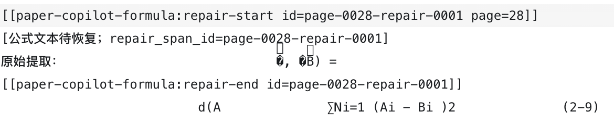
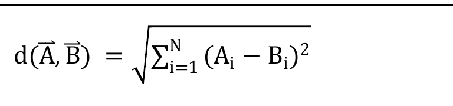
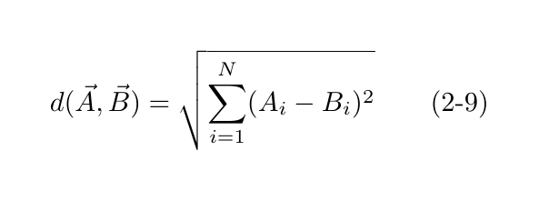
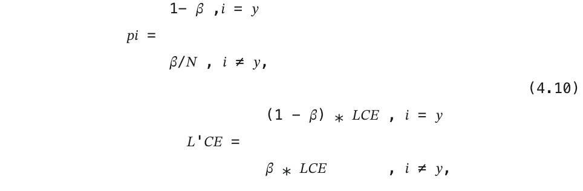
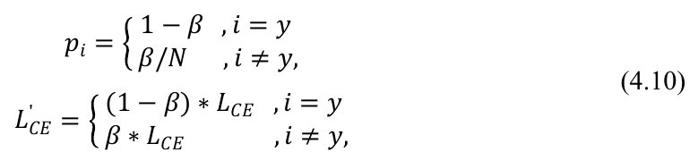
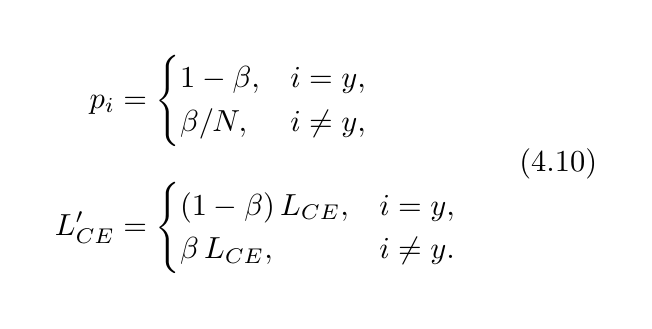

# Paper Copilot

[English](README.en.md) | 简体中文

Paper Copilot 是一款面向 macOS 的本地论文研究智能体（Agent），专门补齐通用 PDF 对话工具
在数学论文上容易失真的证据链：有些 PDF 在阅读器中显示正常，文本层却已损坏，正文尚可搜索，
公式字符或二维结构已经丢失。系统先对能够证明的内嵌字体映射做确定性修复；文本仍不足时，
Agent 根据当前问题主动定位原 PDF 的页码和区域，只对真正需要的公式调用本地公式 OCR，而不是
预先 OCR 整篇论文。

识别结果绑定 PDF SHA-256、物理页、明确区域和渲染证据哈希，写入可失效的版本化缓存，后续
会话可以直接复用。公式结果仍保留 `verified=false`，原始 PDF 始终是权威来源。这样，低成本
纯文本模型也能获得通常需要视觉模型或全文 OCR 才有的局部公式证据。

### 与常见方案的区别

下表比较的是设计重点，不是对所有同类产品能力的绝对断言。

| 常见方案 | 典型侧重点 | Paper Copilot 额外解决的问题 |
| --- | --- | --- |
| PDF 对话与多文档问答 | 对已提取文本进行检索、问答和引用 | 先修复“页面显示正常、文本提取损坏”的可证明字体映射，再决定哪些公式需要回到原 PDF |
| 本地检索增强生成（RAG）与研究 Agent | 建立索引、检索片段并组织答案 | 派生证据绑定 PDF 哈希、提取器版本和缓存版本（revision）；原 PDF 变化或提取器升级后旧结果自动失效 |
| 全文 OCR 或高保真解析 | 预先处理整篇文档，以换取更完整的结构 | 先用快速文本缓存探索，只对当前任务依赖的公式区域执行本地 OCR，并跨会话复用已接受结果 |

macOS 客户端负责论文目录授权、模型与可选 OCR 组件设置、任务停止与恢复、运行追踪和报告中的
原文跳转；真正的产品差异来自其下方共享的 PDF 证据管线与 Agent 运行时，而不只是一个聊天界面。

在冻结的同模型完整系统实验中，同一个 `deepseek-v4-flash` 在 Paper Copilot 中的答案正确性
得分为 **100%**，Codex CLI 为 **88.89%**，同时耗时、词元（Token）和模型成本更低。该结果
仅适用于本次论文、任务与配置，也不能把差异单独归因于某个组件。


## 技术重点

### 面向长任务的 Agent harness

模型决定下一步行动，并通过工具完成论文检索、页面读取、坐标查询和公式识别。运行时在调用前
校验参数与文件权限，并限制执行时间和返回大小。研究流程由 Skill 规定，包括证据引用方式和
工具调用条件。

系统会阻止重复或高度相似的工具调用。上下文工程（context engineering）控制进入模型的信息：
论文正文按需读取，工具返回限制在设定大小内；历史过长时自动压缩为结构化摘要，保留论文 ID、
页码证据和关键决策。被压缩的历史细节不再占用模型上下文，论文内容仍可按需重新读取；完整会话
和调用记录继续保留，用于任务恢复与审计。较高风险的操作在执行前由独立审批模型按风险和授权
进行判定。

conversation、job、attempt、session 和 trace 分层保存，支持任务恢复、失败重试和调用追踪。
macOS 客户端与 MCP Server 共享 Python 核心（Python Core），论文处理逻辑只维护一份。

### 缓存按需建立，旧版本自动失效

研究同一篇论文时，搜索、翻页和回看反复用到相同内容。每次重新解析 PDF 既慢，又会让模型
重复读取大段正文。所以 Paper Copilot 只缓存当前任务实际用到的论文，不在启动时扫描整个
论文库。

缓存不只是性能优化，也是修复后文本的持久化层。字体映射恢复出的字符写入缓存，不修改原
PDF；后续任务直接读取同一修复版本。

缓存绑定 PDF SHA-256 和提取器指纹（extractor fingerprint）。论文被替换或文本提取逻辑升级
后，系统生成新的缓存版本（revision），旧结果随之作废。新缓存完整写入并通过校验后才替换当前
版本，文件锁用于避免并发写入破坏数据。

### 修复 PDF 文本层里的数学乱码

部分论文在阅读器中显示正常，但文本提取后会出现数学符号乱码，或丢失根号、向量、上下标、
求和范围和分段括号。即使正文仍然可读，公式语义也可能已经损坏。

PDF 阅读器可以直接使用内嵌字体的字形绘制页面，而文本提取器需要依靠 ToUnicode 将 PDF
字符码转换为 Unicode。因此，缺少映射的公式可能显示正常，提取后却变成私用区字符、控制字符
或替换字符。

Paper Copilot 只修复可以证明的映射。系统先验证 PDF 字符码、字符标识符（CID）与内嵌字形
标识符（GID）之间的关系，再利用字体的 cmap、MATH 表或 Adobe Symbol 编码恢复字形对应的
Unicode，并为可证明的映射临时补全 ToUnicode。控制字符仅在确认对应空字形时移除；无法确定
的字符不会被猜测。整个过程不修改原 PDF，修复后的文本写入版本化缓存。

在 7 篇代表性学位论文中，显式乱码率从约 **0.4124%** 降至 **0.0069%**：

| 指标 | 修复前 | 修复后 | 变化 |
| --- | ---: | ---: | ---: |
| 显式乱码字符 | 12,035 个 | 202 个 | 减少 11,833 个 |
| 文本字符 | 2,918,226 个 | 2,908,673 个 | — |
| 显式乱码率 | 0.4124% | 0.0069% | **相对减少 98.32%** |

这里的“显式乱码”包括私用区字符、替换字符和异常控制字符。这个指标反映的是文本层的明显
损坏，不是公式准确率；有些公式没有乱码，二维结构却可能已经丢了。

[查看字体恢复验证](docs/design/pdf_font_unicode_repair_validation.md)

### Agent 定位公式并执行局部 OCR

Paper Copilot 不依赖单独训练的公式检测或文本定位模型，也不预埋完整公式框。字体映射修复
先尽量恢复可搜索的编号与上下文；对于仍包含损坏字符的非正文行，缓存仅记录首尾损坏字符的
坐标作为弱提示。公式 OCR 技能（Formula OCR Skill）再指导通用研究模型结合文本锚点和原
PDF 的逐字符几何信息，自主选择裁剪区域。系统仅渲染选定区域，并交给本地公式 OCR
（Formula OCR）转写，不预先扫描整篇论文。

下面是两次真实运行的结果。第一处公式丢失了向量、根号和求和结构，第二处丢失了分段括号和
二维排版。Agent 首次选择的区域均完整覆盖目标公式，本地 OCR 分别耗时约 **8.7 秒**和
**3.1 秒**。这证明该路径在这两个案例中有效，但样本不足以说明它在任意论文和版式中都具有
同样的定位表现。

| 文本缓存里的乱码 | Agent 选出的原 PDF 区域 | Formula OCR 结果 |
| --- | --- | --- |
|  |  |  |
|  |  |  |

识别结果经 Agent 检查后才写入缓存。若裁图不完整或结果不可靠，Agent 可以调整区域重试；
无法确认时，则在报告中明确说明。已确认的公式可在后续会话中复用。

[了解 Formula OCR 组件](docs/design/formula_ocr_optional_component.md)

## 与 Codex CLI 的同模型实验

这不是模型之间的比较。Paper Copilot 和 Codex CLI 使用同一个
`deepseek-v4-flash`（DS V4 Flash），读取同一份 PDF，回答同一组问题，联网限制和运行预算
保持一致。每个任务都从新会话开始；标准答案、评分规则和原子事实标签在查看回答前已经固定。

正确性按原子事实计分：正确为 `1` 分，部分正确为 `0.5` 分，错误或缺失为 `0` 分。耗时、
词元（Token）和成本从运行记录中统计，不参与正确性评分。

| 指标 | 单位 | Paper Copilot | Codex CLI | 相比 Codex CLI |
| --- | --- | ---: | ---: | ---: |
| 答案正确性得分（部分正确计 0.5 分） | % | **100.00** | 88.89 | **提高 11.11 个百分点** |
| 正式任务总耗时 | 秒 | **388** | 1,947 | **减少 80.1%** |
| 总词元 | Token | **736,319** | 19,271,592 | **减少 18,535,273（96.2%）** |
| 可归属模型成本 | 元 | **0.170** | 1.044 | **减少 83.8%** |

结果只代表本次论文、模型和完整 Agent 配置，不能直接外推到其他场景，也不能将差异单独归因
于某个组件。

[查看实验设置和评分规则](eval/experiments/codex-vs-pc-deepseek-font-repair-ocr-v2/experiment.md)

## macOS 客户端

客户端使用 SwiftUI 开发，提供论文目录授权、模型设置、任务时间线、停止与恢复、诊断信息和
研究报告展示。App 设计为通过内嵌的 Python 运行时（Python Runtime）调用 Python 核心
（Python Core）。


| 模型切换 | 设置与本地 Formula OCR |
| --- | --- |
|  |  |

## 安装

面向 Apple Silicon 的
[Paper Copilot v0.1.0 Preview 1](https://github.com/lemma42796/paper-copilot/releases/tag/v0.1.0-preview.1)
已经发布。下载 `PaperCopilot-arm64.dmg`，打开后将 Paper Copilot 拖入“应用程序”。该预览版
使用 ad-hoc 签名且未经 Apple 公证；首次启动若被 macOS 阻止，请先尝试打开一次，再到
“系统设置 → 隐私与安全性”选择“仍要打开”。

[Formula OCR v1.1.0](https://github.com/lemma42796/paper-copilot/releases/tag/formula-ocr-v1)
已作为独立可选组件公开发布，可在设置中按需安装。当前已核对两个 Release 的公开资产、manifest
和摘要；尚未从 GitHub Release 执行一次全新 App 安装及 Formula OCR 下载链路验证。

## 从源码运行

```bash
git clone https://github.com/lemma42796/paper-copilot.git
cd paper-copilot
uv sync --dev
open apps/macos/PaperCopilot.xcodeproj
```

PDF、缓存、任务记录和报告默认保存在本地。使用云端模型时，当前任务选中的论文文本和工具结果
会进入模型上下文。

## 技术栈

SwiftUI · Python 3.12 · Pydantic · asyncio · Poppler · PyMuPDF · fontTools · SwiftMath ·
PaddleX · PP-FormulaNet_plus-M

## 文档

[架构](ARCHITECTURE.md) · [实验](docs/design/experiment_index.md) ·
[Formula OCR](docs/design/formula_ocr_optional_component.md) · [当前任务](TASKS.md)

## License

本版本中的 Paper Copilot 原创代码采用 [Apache License 2.0](LICENSE)，版权归属见
[NOTICE](NOTICE)。第三方组件仍适用各自的许可证；此前已经按 MIT 发布的版本继续适用其
发布时附带的 MIT 许可证。
