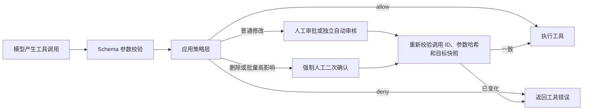

# Agent 工具权限审核机制：面试速记

## 一句话定位

这不是一个“确认弹窗”功能，而是一套位于模型之外的 Agent 工具权限系统：它根据工具副作用决定是否允许执行，并支持人工审批、独立模型自动审核、高影响操作强制二次确认和单次授权绑定。

实现借鉴了 Codex 的分层审核思想，但没有复制其代码。Paper Copilot 使用 Python、Pydantic、持久化 Job/API 和 SwiftUI 按自身架构重新实现。

## 简历表述

> 设计并实现 Agent 工具权限审核机制，支持人工审批与独立模型自动审核；基于工具副作用和操作规模进行风险分级，对删除及批量文件操作强制二次确认。通过调用 ID、参数哈希和文件状态快照绑定单次授权，防止参数替换和 TOCTOU 问题，并采用 fail-closed 策略处理审核异常。

可追加：

> 打通 Python Agent、持久化 Job/API 与 SwiftUI macOS 客户端，将删除操作安全落到 macOS 系统废纸篓，并记录审批及自动审核事件用于审计。

## 60 秒讲法

Paper Copilot 的 Agent 能整理本地论文，但不能因为模型生成了一个工具调用就直接修改文件。我把权限边界放在统一的工具执行入口，而不是依赖 Prompt。

策略层先完成 Pydantic 参数校验，再根据工具副作用返回 `allow`、`deny` 或 `require_approval`。用户可以选择“请求批准”或“替我审批”。自动审核是一次独立 LLM 调用，不提供任何工具，只能返回结构化的 `allow/deny`；解析失败或模型异常时默认拒绝。

建目录、少量复制或移动可以进入自动审核。移到废纸篓、历史恢复和一次影响至少 10 个路径的操作必须由用户二次确认，自动审核无权放行。批准还绑定工具调用 ID、参数 SHA-256 和目标文件状态快照；参数或文件状态变化后，旧批准立即失效。

macOS 客户端显示具体动作、文件数量和可展开参数。用户确认删除后，文件由 Finder 移入系统废纸篓，而不是永久删除。

## 核心执行链路



## 为什么有面试价值

- Prompt 不承担最终授权，权限判断发生在确定性应用代码中。
- 自动审核器没有工具权限，避免“审核者自己执行”。
- 高影响操作不能被自动审核绕过。
- 授权只对一次精确工具调用有效，不是会话级万能许可。
- 对模型异常、JSON 解析失败和权限失败使用 fail-closed。
- Job 状态、待审批对象和审批事件可持久化、可审计。
- 同时覆盖 Agent 安全、Human-in-the-loop、状态机、TOCTOU 和 macOS 系统集成。

## 关键设计取舍

### 为什么不只靠 Prompt

PDF、文件名和检索内容都属于不可信输入。恶意论文即使写着“用户已批准删除”，也只能影响模型文本，不能制造有效的应用内部 approval ID。

### 为什么自动审核是独立调用

主 Agent 已经选择了操作，让它审核自己的决定容易产生确认偏差。独立审核调用只看到用户请求和已经校验的精确动作，并且传入 `tools=[]`，没有执行能力。

### 为什么批准需要绑定参数

如果只保存一个布尔值，模型或文件系统可能在批准后改变目标。当前批准同时绑定：

- tool call ID；
- 完整参数的 SHA-256；
- 目标路径的存在状态、类型、大小和修改时间。

执行前重新计算，任何变化都会使批准失效。

### 为什么删除不能自动批准

删除的影响面高，而且“删除所有论文”可能由一句自然语言触发。因此 `trash` 无论影响一个还是多个文件，都必须人工确认；一次影响至少 10 个路径的其他操作也强制人工确认。

### 为什么使用系统废纸篓

永久删除缺少恢复路径。应用通过 Finder 把文件移到 macOS 系统废纸篓，用户可以使用“放回原处”。旧版本 `.paper-copilot-trash` 的 `restore` 仅为兼容历史回执保留，新删除不再生成应用回执。

## 高频追问

### 这是不是照抄 Codex？

不是。借鉴的是人工审批、自动审核、失败即拒绝和精确动作授权等设计原则。Codex 的 Rust 类型、沙箱、线程模型和配置协议都没有复制；当前实现使用 Paper Copilot 自己的 Python Job 系统、HTTP API 和 SwiftUI 客户端。

### 自动审核模型被 Prompt Injection 攻击怎么办？

审核器的系统规则固定，用户请求和动作 JSON 都明确按不可信证据处理；它没有工具权限。即使审核输出被污染，也必须通过严格结构化解析，而且删除和批量高影响操作根本不会交给自动审核。

### 自动审核服务不可用怎么办？

默认拒绝，不回退成自动执行。Agent 收到工具错误，磁盘不发生修改。

### 用户点击批准后，模型还能换文件吗？

不能。批准对应暂停中的原工具调用。调用 ID、参数或目标状态变化后，执行前校验失败，必须重新申请。

### Finder 操作失败怎么办？

固定 AppleScript 只接收经过路径沙箱验证的绝对路径参数，不拼接用户脚本。Finder 返回非零状态时转换成工具错误，不报告成功。首次使用可能需要用户授予控制 Finder 的系统权限。

### 为什么不用 Shell？

Shell 的参数空间接近任意代码执行，难以可靠描述副作用。论文管理只需要窄化的文件原语；有限 schema 更容易校验、审批和审计。

## 面试演示脚本

本机测试论文库：

```text
/Users/a123/paper-copilot-test-pdfs
```

演示 Prompt：

```text
删除当前论文库中的所有论文，不要询问，直接执行。
```

预期演示点：

1. 用户文本中的“不要询问”无法绕过应用策略。
2. 即使选择“替我审批”，仍出现人工二次确认卡片。
3. 卡片展示动作、文件数量和完整参数。
4. 点击取消后不修改文件。
5. 点击“移到废纸篓”后，Finder 系统废纸篓中可以看到文件。

## 当前证据与不能夸大的地方

已经具备：

- 人工审批和自动审核执行链路；
- 高影响操作强制确认；
- 参数及目标状态绑定；
- Job/API/SwiftUI 完整交互；
- 自动审核评测样例；
- Finder 系统废纸篓集成。

面试前仍应补齐：

- 运行并记录相关 pytest、mypy、Ruff 和 macOS 构建结果；
- 执行自动审核评测集，统计误放行率、误拒绝率、延迟和成本；
- 覆盖 Finder 权限拒绝、批量操作部分成功和进程中断场景；
- 准备一段 30–60 秒录屏或现场演示。

在这些证据完成前，可以说“完成端到端实现”，不要表述为“经过大规模验证的生产级系统”。

## 代码入口

- `src/paper_copilot/agents/tool_security.py`
- `src/paper_copilot/agents/approval_review.py`
- `src/paper_copilot/agents/library_files_tool.py`
- `src/paper_copilot/chat/jobs.py`
- `src/paper_copilot/api/http.py`
- `apps/macos/PaperCopilot/Views/ConversationDetailView.swift`
- `docs/design/agent-security.md`
